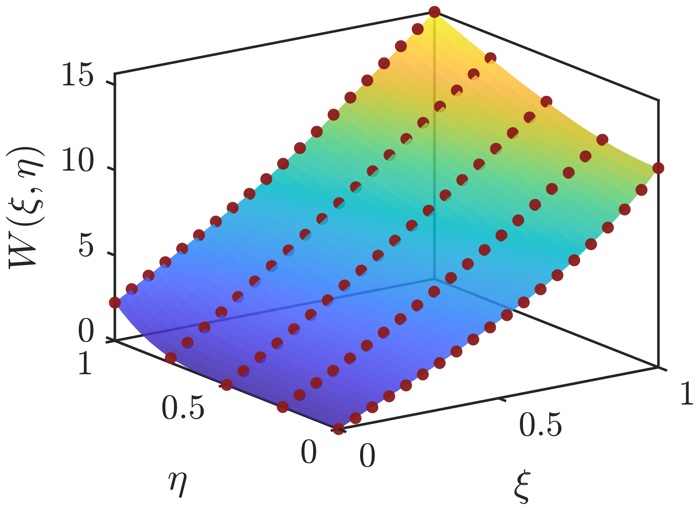
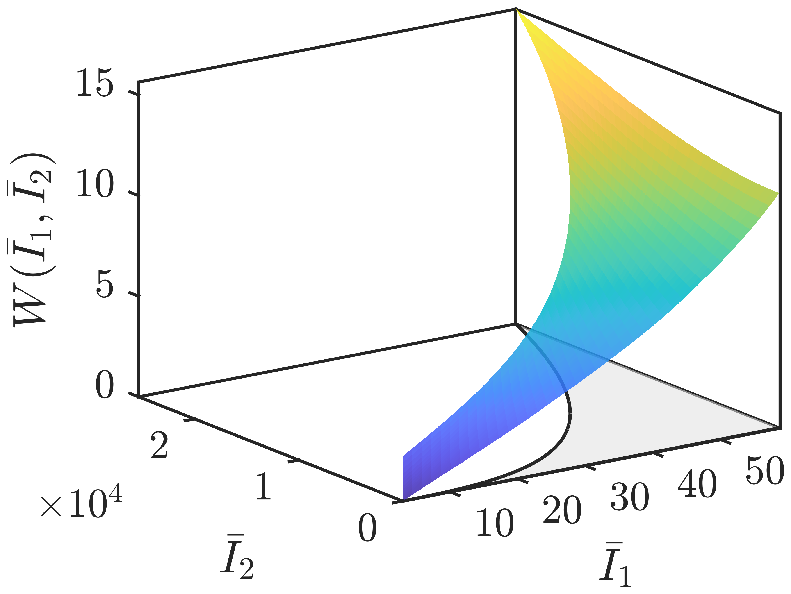
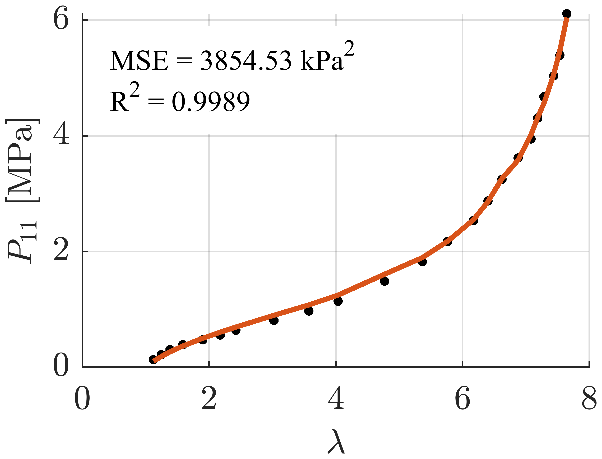
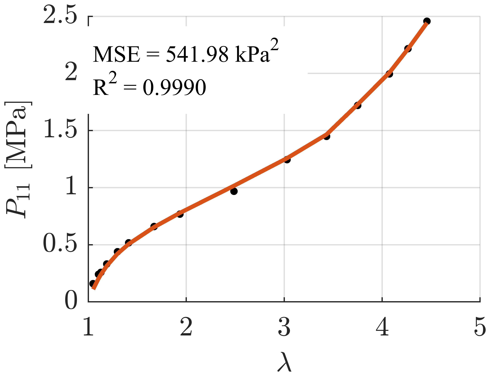
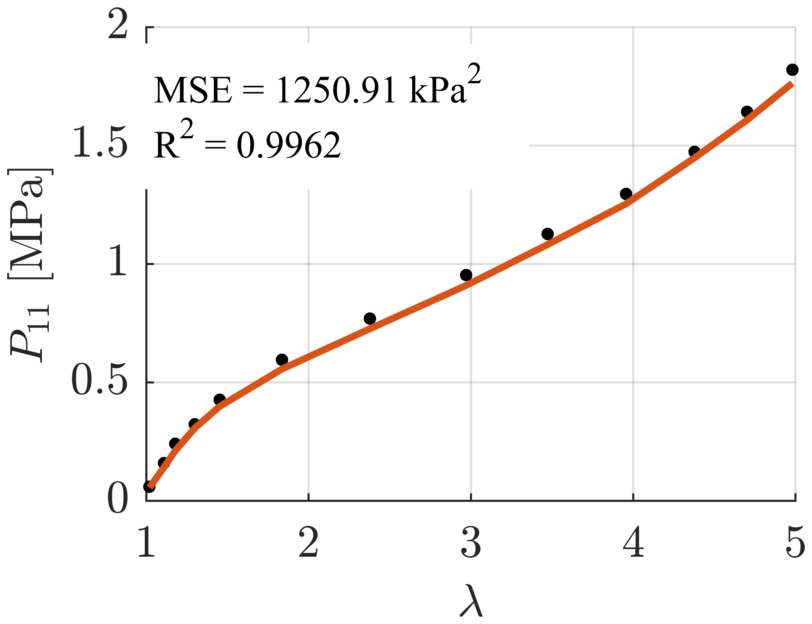

# Bivariate Spline Hyperelasticity

This repository provides a MATLAB implementation of a data-driven constitutive modeling framework for incompressible isotropic hyperelasticity based on **bivariate B-spline surfaces**.

The key idea is to represent the strain-energy density function on the **physically admissible invariant domain**, enabling:

- full coupling between invariants,
- efficient use of model parameters,
- and **fast, robust calibration via linear least-squares**.

Despite its high expressiveness, the model remains linear in its parameters, enabling fast, robust, and initialization-independent calibration in well under one second.

---

## Quick Start

Navigate to the `main` folder and run:

```matlab
run_fit_eq(struct('type', 'univariate'))
```

This fits the separable (univariate) spline model.

To fit the bivariate spline surface in mapped coordinates $(\xi,\eta)$, run:

```matlab
run_fit_eq(struct('type', 'surface_uv'))
```

The calibration is finised in **0.06 seconds**, and the results are saved in `fit_result_eq.mat`.

After calibration, generate all plots and evaluation results using:

```matlab
postprocess_eq('fit_result_eq.mat')
```

This creates a postprocessing folder containing:

 - model fits for UT, BT, PS
 - spline surface in $(\xi,\eta)$
 - pullback to $(I_1, I_2)$
 - parameter activation

## Example results

<p align="center">
  
  
</p>

<p align="center">
  
  
  
</p>

## References
 - [1] S. Wiesheier, M.A. Moreno-Mateos, and P. Steinmann,  
  *Data-adaptive spline surfaces for non-separable hyperelastic energy functions*,  
  arXiv:2604.10059 (2026). https://arxiv.org/abs/2604.10059